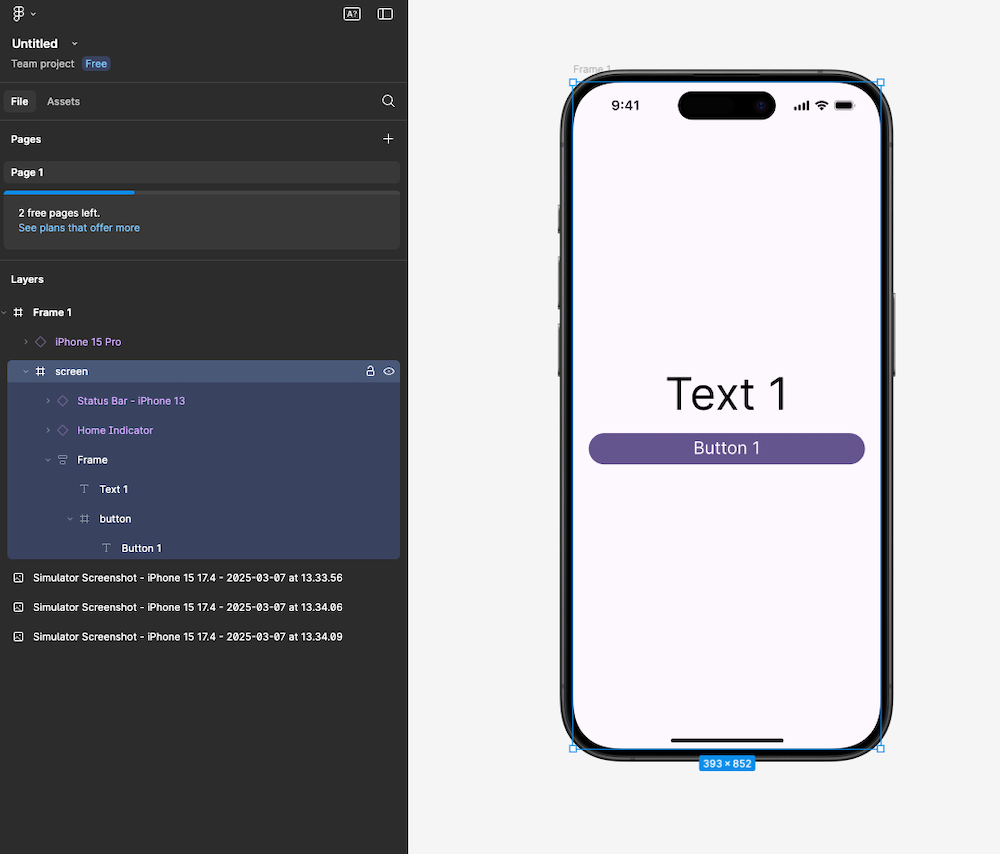
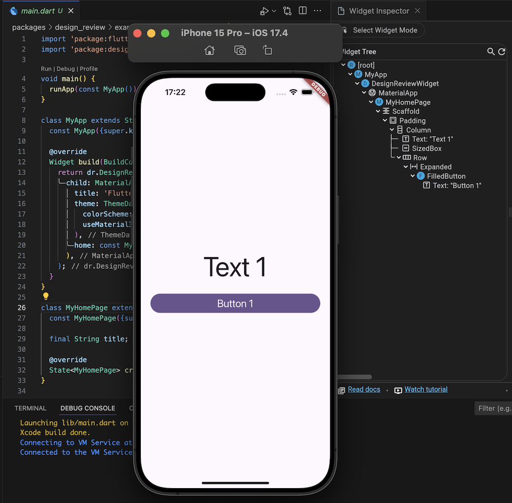
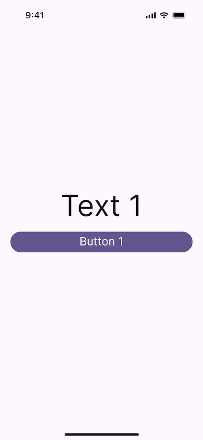
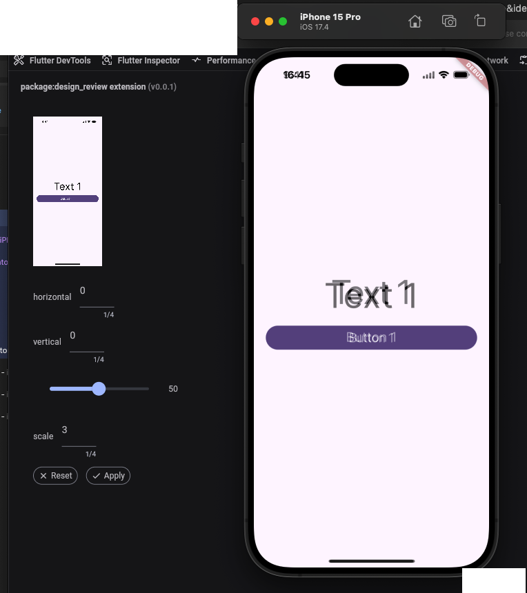

# design_review

package with dev tool extension to compare Figma's UI with developed UI.

## TL;DR

- 🔍 **Compare Figma designs with Flutter UI** by overlaying exported screens.
- 🛠 **Detect inconsistencies** in padding, alignment, and typography.
- 🚀 **Improve design validation** and ensure pixel-perfect implementation.
- 📦 **Works as a DevTools extension** in debug mode.
- 🎨 **Simple setup**: Add the package, wrap your widget, and upload the Figma image.

## Problem

Usually, designer creates screens on Figma.

Then you develop UI based on the Figma screen:

When you finish, you can ask yourself: **"Whether my design matches Figma? Did I miss any padding?"**.

And here **design_review** Dev Tool extension for rescue!

## Usage

add package to dependencies in the `pubspec.yaml` file.

cover your top level widget with `DesignReviewWidget`. FYI It works only in **Debug** mode. By default it uses `TextDirection.ltr`, you can change to `TextDirection.rtl` if needed.

Then either you or ask your designer to export screen from Figma.

I exported this screen with 3.0 scaling:

Start Flutter app debugging.
Then open [Dev Tools](https://docs.flutter.dev/tools/devtools#start) in browser and find design_review extension on the top panel.

Tap **"select image"** button and select exported image from Figma. Click **"Apply"**.
It'll look like that:

on the result screen we can see that padding matches, but texts are not. In my case I have a bit different fonts in Figma and Flutter app so it showed me an issue and now I know what I missed.

thanks for reading. Hope it helped you <3.

## P.S

Consider using a flexible layout to make your UI adaptable. If you avoid hardcoding widths and heights, and your design matches the Figma layout on the same device, you're on the right track!
